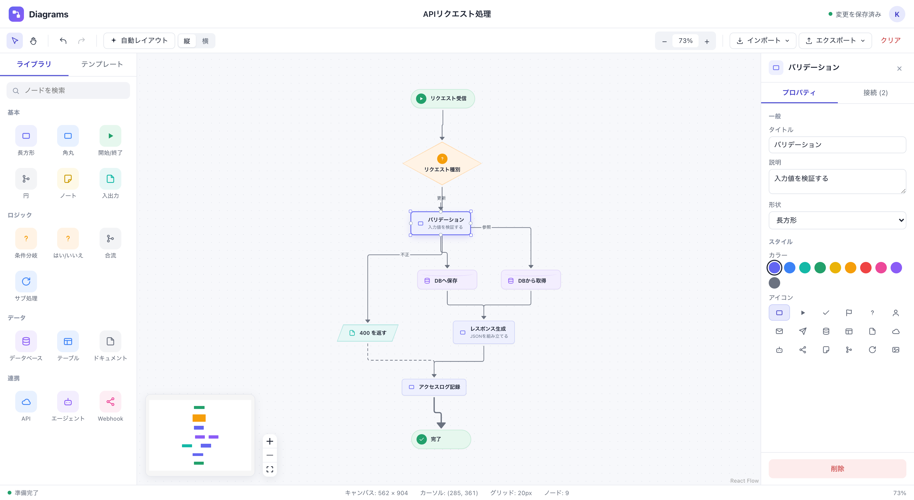
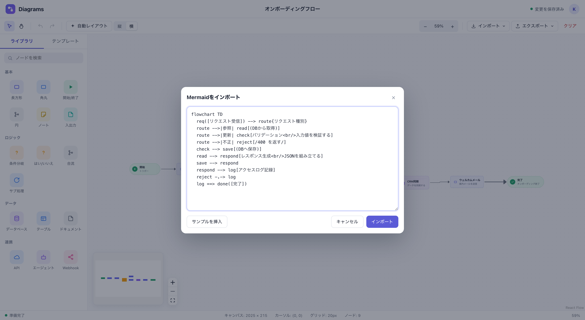
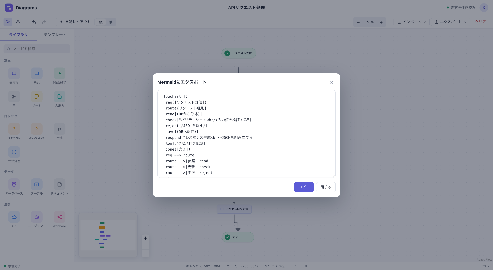
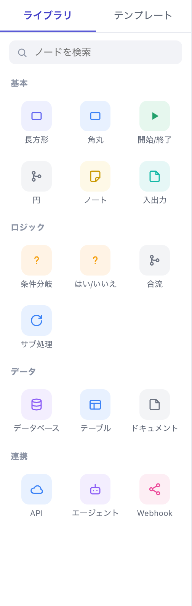
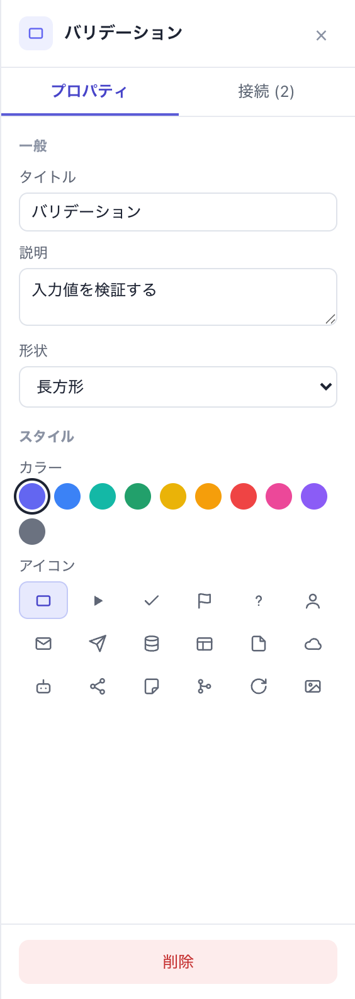
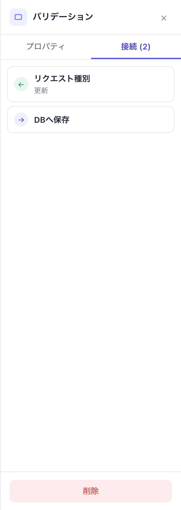
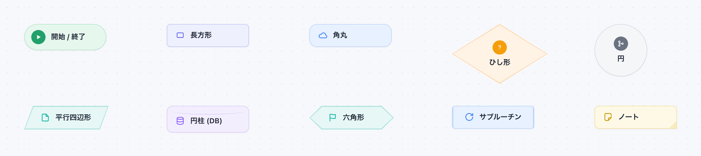

<h1 align="center">Diagrams Editor</h1>

<p align="center">
  Mermaid記法のインポート/エクスポートに対応した、ブラウザで動くフローチャートエディタ<br>
  <sub>A web-based flowchart editor with Mermaid import/export, built with React Flow.</sub>
</p>

<p align="center">
  
  
  
  
</p>



Mermaidで書いた図を貼り付けて編集したり、白紙からノードを並べて繋いだりできます。編集した図はいつでもMermaid記法に書き戻せるので、ドキュメントやissueへの貼り付けもそのままできます。データはブラウザのローカルストレージに自動保存され、サーバーは必要ありません。

## 使い方

```bash
git clone https://github.com/bitpackman/diagrams-editor.git
cd diagrams-editor
npm install
npm run dev
```

表示されたURL(デフォルトは http://localhost:5173)をブラウザで開きます。ビルドは `npm run build`、ビルド結果の確認は `npm run preview` です。

## 主な機能

### Mermaidをインポートする

`flowchart TD` / `graph LR` などのフローチャート記法を貼り付けると、形状・ラベル・線種を保ったままノードに変換されます。配置は [dagre](https://github.com/dagrejs/dagre) が自動で決めるので、座標を指定する必要はありません。構文エラーは行番号付きで表示されます。



### Mermaidに書き戻す

編集後の図はいつでもMermaid記法として取り出せます。インポートした記法とほぼ同じ形に戻るので、リポジトリのドキュメントに反映するのも簡単です。



### ノードを置いて繋ぐ

左のライブラリからドラッグ&ドロップ、またはクリックでノードを追加します。キャンバスのダブルクリックでも追加できます。ノードにカーソルを合わせると接続ハンドルが現れ、ドラッグすると線が引けます。ノードのダブルクリックでタイトルをその場で編集できます。

<table>
<tr>
<td width="34%"></td>
<td width="33%"></td>
<td width="33%"></td>
</tr>
<tr>
<td align="center"><sub>カテゴリ別のノードライブラリ</sub></td>
<td align="center"><sub>タイトル・説明・形状・色・アイコン</sub></td>
<td align="center"><sub>入出力の接続一覧</sub></td>
</tr>
</table>

選択したノードは右のパネルで、タイトル・説明・形状・カラー(10色)・アイコン(18種)を変更できます。接続線を選ぶとラベル・線種(実線 / 点線 / 太線)・矢印の有無を設定できます。「接続」タブにはそのノードの入出力が一覧され、クリックすると対応する線が選択されます。

### 10種類のノード形状



### そのほか

- **自動レイアウト** — 縦(上から下)/ 横(左から右)の切り替えと整列
- **Undo / Redo** — `⌘Z` / `⇧⌘Z`(ツールバーのボタンでも操作できます)
- **エクスポート** — PNG画像 / Mermaid記法 / JSON(座標を保持した保存・復元用)
- **テンプレート** — オンボーディングフロー・承認フローなどのサンプルを同梱
- **自動保存** — 編集内容はローカルストレージに保存され、リロードしても復元されます

## 対応しているMermaid記法

フローチャート(`flowchart` / `graph`)のサブセットに対応しています。

| 種類 | 記法 |
| --- | --- |
| 方向 | `TB` `TD` `BT` `LR` `RL`(`BT`は`TB`、`RL`は`LR`として扱います) |
| ノード形状 | `[長方形]` `(角丸)` `([開始/終了])` `((円))` `{ひし形}` `{{六角形}}` `[/平行四辺形/]` `[(円柱)]` `[[サブルーチン]]` |
| 接続線 | `-->` `---` `-.->` `-.-` `==>` `===` `<-->` |
| ラベル | `A -->|はい| B` と `A -- はい --> B` の両方 |
| 連鎖・グループ | `A --> B --> C` / `A & B --> C` |
| 改行 | ラベル内の `<br/>`(1行目がタイトル、2行目以降が説明になります) |

`subgraph` `classDef` `style` `linkStyle` などの行は読み飛ばします(エラーにはなりません)。サブグラフの枠は再現されず、中のノードのみが取り込まれます。

## 技術構成

| | |
| --- | --- |
| UI | React 19 + TypeScript + Vite |
| グラフ描画 | [@xyflow/react](https://reactflow.dev/)(React Flow v12) |
| 自動レイアウト | [@dagrejs/dagre](https://github.com/dagrejs/dagre) |
| 画像書き出し | [html-to-image](https://github.com/bubkoo/html-to-image) |
| Mermaid変換 | 自前実装(依存ライブラリなし) |

```
src/
  App.tsx                 エディタ本体(状態管理・Undo/Redo・入出力)
  palette.ts              ノードライブラリの定義(形状・色・アイコン)
  templates.ts            テンプレート(Mermaid文字列)
  types.ts                ノード / エッジの型定義
  mermaid/parseMermaid.ts Mermaidフローチャートのパーサー
  mermaid/toMermaid.ts    Mermaidテキストへのシリアライザ
  flow/layout.ts          dagreによる自動レイアウト
  flow/convert.ts         Mermaid → React Flow変換
  flow/edgeUtils.ts       エッジのスタイル・ハンドル決定
  components/             UIコンポーネント(ノード・ツールバー・パネル等)
```

## ライセンス

[MIT](LICENSE)
